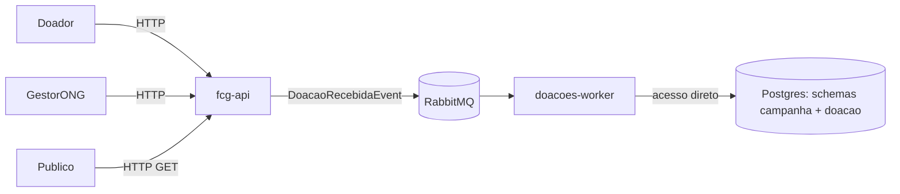

# Conexão Solidária — Arquitetura (Fase 5)

> Este documento substitui qualquer versão anterior em PDF. Se você encontrar
> um `Conexao_Solidaria_Arquitetura.pdf` por aí, ele descreve o desenho
> **antigo** (3 repositórios, Kong, bounded contexts isolados) e está
> desatualizado. Esta é a versão corrente.

## Domínio e subdomínios

**Domínio:** captação e gestão de doações para ONGs — conectar doadores a
campanhas com transparência sobre valores captados.

| Tipo | Escopo | Por quê |
| --- | --- | --- |
| Subdomínio Principal | Gestão de Campanhas, Processamento de Doações, Painel de Transparência | É onde está a regra de negócio real e a complexidade técnica |
| Subdomínio Genérico | Autenticação e Autorização (Identidade) | Padrão de mercado, não diferencia a ONG de nenhum outro sistema |
| Subdomínio de Suporte | Cadastro de Doador | CRUD simples que apoia o core |

## Agregados

Campanha e Doação são **dois agregados separados**, mesmo estando no mesmo
subdomínio principal e no mesmo banco físico:

- **Campanha**: Titulo, Descricao, DataInicio, DataFim, MetaFinanceira,
  Status (Ativa/Concluida/Cancelada), ValorArrecadado
- **Doacao**: IdCampanha (referência por ID, nunca composição), IdDoador,
  ValorDoacao, Status (Pendente/Confirmada/Rejeitada)

Por que não juntar num agregado só ("Campanha contém lista de Doações"): uma
campanha pode ter milhares de doações — modelar como lista interna travaria o
agregado inteiro a cada escrita. "Campanha tem uma lista de doações" é
verdade como **consulta** (FK `IdCampanha` + índice), não como modelagem de
agregado. Além disso, o próprio fluxo assíncrono exigido pelo edital já
pressupõe duas transações distintas — se fossem um agregado só, a atualização
seria uma escrita transacional direta, sem necessidade de fila.

## Arquitetura de serviços

**Modelo: monolito modular com Worker.** Um repositório, dois processos
deployáveis:

| Serviço (pod) | O que contém | Entrada |
| --- | --- | --- |
| `fcg-api` | Módulos Identidade + Campanha + Doacao, organizados em pastas (não em projetos/repos separados) | HTTP |
| `doacoes-worker` | Processa `DoacaoRecebidaEvent`, atualiza Campanha e confirma/rejeita a Doação | Fila (RabbitMQ) |

Sem API Gateway (Kong ficou de fora — era opcional no edital).
Autenticação/autorização acontecem dentro da própria API.



## Banco de dados

**1 instância Postgres, 3 schemas** — `identidade`, `campanha`, `doacao` —
não 3 databases separados. Essa escolha é o que permite ao Worker aplicar
uma única transação Postgres real cobrindo os dois schemas ao processar uma
doação:

```sql
begin;
  update campanha.campanhas
    set valor_arrecadado = valor_arrecadado + :valor
    where id = :idCampanha and status = 'Ativa';
  update doacao.doacoes
    set status = 'Confirmada'
    where id = :idDoacao;
  insert into doacao.doacoes_processadas (id_doacao) values (:idDoacao); -- idempotência
commit;
```

Sem isso (bancos fisicamente separados), seria necessário outbox pattern ou
saga — complexidade que o grupo decidiu evitar dado o prazo.

O padrão de schema-por-módulo **já existe** no repositório base
(`IdentidadeDbContext.SCHEMA = "identidade"`) — só replicar para os módulos
novos.

## Por que a fila continua sendo necessária (mesmo com banco único)

A fila não existe para "ligar dois bancos diferentes" — existe para
desacoplar o *momento* da requisição HTTP do *momento* do processamento:

- **Exigência literal do edital**: broker obrigatório para esse fluxo, e a
  API não pode atualizar o valor arrecadado direto na mesma requisição
- **Latência/disponibilidade**: a API responde `202 Accepted` na hora; o
  processamento roda no ritmo do Worker
- **Resiliência**: mensagem não processada fica na fila e é reprocessada,
  em vez de perder a doação se o processamento falhar no meio
- **Escala independente**: em pico de doações, escala-se só o Worker

O acesso direto ao banco elimina o *salto de rede entre serviços* (não
precisa HTTP de um serviço pro outro); a fila continua sendo o que preserva
a fronteira entre os dois agregados mesmo com banco compartilhado.

## Idempotência

O Worker precisa ser idempotente — se o broker reentregar uma mensagem já
processada, não pode somar o valor duas vezes. Resolvido com a tabela de
controle `doacao.doacoes_processadas` (ver transação acima): antes de
aplicar o incremento, verifica se o `IdDoacao` já foi processado.

## Autenticação e autorização

- JWT **HMAC simétrico** (não RS256 — o repositório base já implementa
  assim, em `JwtService.cs`), emitido e validado pela própria API
- Roles: `GestorONG` e `Doador` (renomeadas a partir do enum `PerfilUsuario`
  existente: `Administrador` → `GestorONG`, `Usuario` → `Doador`)
- Sem Gateway: toda validação de token e checagem de role acontece dentro da
  API, via `[Authorize(Roles = "...")]` padrão do ASP.NET

## Rotas públicas (sem JWT)

- `POST /doadores` — cadastro de doador
- `POST /auth/login`
- `GET /campanhas` — painel de transparência (só campanhas `Status: Ativa`,
  retornando Titulo, MetaFinanceira, ValorArrecadado)

## Estrutura de pastas (Clean Architecture, módulo = pasta)

```
src/
├── FCG.Domain/{Identidade, Campanha, Doacao, Shared}/...
├── FCG.Application/{Identidade, Campanha, Doacao, Shared}/...
├── FCG.Infrastructure/{Identidade, Campanha, Doacao, Shared}/...
├── FCG.IoC/                         ← composição de dependências
├── FCG.API/Controllers/{Auth,Conta,Usuario,Campanha,Doacao}Controller.cs
└── FCG.Worker/                      ← novo projeto, consome DoacaoRecebidaEvent
```

Cada módulo novo (`Campanha`, `Doacao`) segue exatamente a forma de
`Identidade`, que já está implementado no repositório base — ver
`implementacao/fcg-monolito/IMPLEMENTACAO.md` para o mapeamento arquivo a
arquivo.

## Observabilidade e CI/CD (ainda não implementados no repositório base)

- Nenhum Dockerfile existe ainda para a própria API/Worker
- Nenhum pipeline de CI (`.github/workflows`) existe ainda
- Nenhum manifest de Kubernetes existe ainda
- RabbitMQ/MassTransit não estão configurados ainda

Essas quatro coisas são demandas próprias (d2 parcialmente, d3, d4, d5) — não
assumir que algo disso já existe ao ler o código.
